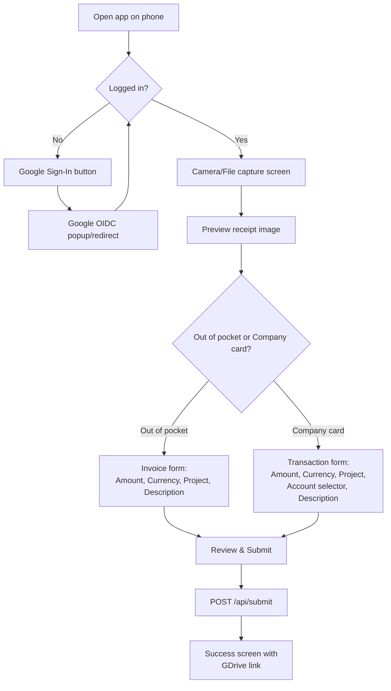

# Antigravity Implementation History

This document contains a consolidated history of all implementation plans drafted by Antigravity across various conversation sessions.


## Session: 011686b3-cbcd-45ab-b6c1-bda47803dfb4

### Implementation Plan - BS3 to BS4 Migration (Test Phase)

## Goal Description
Perform a test migration of legacy data (Sterile BS3) to a new PostgreSQL schema `testschema04feb`.
The process follows three distinct steps:
1. **Schema Creation**: Build the database structure based on `STTMMappingBidstruct4.xlsx`.
2. **Security Application**: Apply Row Level Security (RLS) policies as defined in `# Security restrictions with BS4.md`.
3. **Data Migration**: Load data from `SterileBS3TrashDelete.xlsx` and `BS3toBS4.xlsx` into `testschema04feb`.

## User Review Required
> [!IMPORTANT]
> **Schema Name**: I am targetting `testschema04feb` as requested.
> **Database Connection**: I am assuming the Cloud SQL Proxy is running on `localhost:5432`. I will verify connectivity before starting.
> **Source Files**: I will use `SterileBS3TrashDelete.xlsx` for the "Sterile BS3" data.

## Proposed Changes

### [NEW] Schema Generation Script
I will create a script `create_schema.py` to:
- Read `STTMMappingBidstruct4.xlsx`.
- Generate and execute `CREATE TABLE` statements in `testschema04feb`.

### [NEW] Security Configuration Script
I will extract the SQL from `# Security restrictions with BS4.md` and create `apply_security.sql`, modifying it to target `testschema04feb`.

### [NEW] Data Migration Script
I will create `migrate_data.py` to:
- Handle the complex mapping logic.
- Resolve foreign keys (REFER statements), handling "ID or Name" lookups for ProfitCenter/Account.
- Generate primary keys for new records.
- **Deduplication**: Automatically keep only the first occurrence of Transactions by ID (duplicates handled by Allocation).
- **Invoice Fix**: Use `Invoice_Updated` sheet as source. Map `ProjectID.SalesManager` to `ProfitCenter` (via Name lookup) and usage of `DestinationAccountID`.

## Verification Plan

### Automated Tests
- Schema check: Verify all tables and columns exist in `testschema04feb`.
- Security check: Verify RLS is enabled on target tables.
- Data check: Row count comparisons and referential integrity checks.

### Manual Verification
- User review of `testschema04feb` content.


---


## Session: 0940eb1f-0c44-442d-88d3-762742f796b3

### Install Antigravity Chrome Extension

This plan outlines the steps to install the Antigravity Chrome extension, which enables AI agents to interact with the browser for testing and automation.

## Proposed Steps

### 1. Direct Installation via Chrome Web Store
The quickest way to install the extension is through the official Chrome Web Store link.

- **URL**: [Antigravity Browser Extension](https://chromewebstore.google.com/detail/antigravity-browser-exten/eeijfnjmjelapkebgockoeaadonbchdd)
- **Extension ID**: `eeijfnjmjelapkebgockoeaadonbchdd`

### 2. Manual Search
If the link above does not work:
1. Open the [Chrome Web Store](https://chromewebstore.google.com/).
2. Search for "Antigravity Browser Extension".
3. Verify the publisher is **Google LLC**.
4. Click **Add to Chrome**.

### 3. Alternative "Trigger" Method
You can also trigger the installation prompt directly from this environment:
1. Ask the agent (me) to perform a browser-related task (e.g., "check the status of expertflow.com").
2. A "Setup" button or Chrome icon should appear in the progress panel if browser access is needed.

## Verification Plan

### Manual Verification
1. Once installed, confirm the Antigravity icon appears in your Chrome extensions bar.
2. I will attempt to open a URL using the `browser_subagent` to verify connectivity.


---


## Session: 0bec38ff-04e7-4e65-8dd3-37f11e745cde

### Plan: Confirm Missing Data in BS4Prod09feb2026

The user reports that all invoices and transactions were lost in the `BS4Prod09feb2026` schema between 2026-02-20 and 2026-02-23. This plan outlines the steps to investigate and confirm this.

## Proposed Steps

1. **Verify Database Connectivity**: Use existing `config.py` settings to attempt a connection to the database. If `localhost` fails, I will try the IP provided in the user rules.
2. **Count Records**: Run SQL queries to count rows in:
   - `BS4Prod09feb2026.invoices`
   - `BS4Prod09feb2026.transactions`
3. **Check for Recent Activity**: Query for records with `created_at` or `updated_at` (or equivalent columns) between 2026-02-20 and 2026-02-23.
4. **Historical Comparison**: If there are logs or previous execution outputs (like `integrity_final_v*.txt` or `migration_final.log`), compare the current counts with those recorded previously.
5. **Check other schemas**: Briefly check `bs4_sandbox` or other recent schemas (like `BS4Prod08Feb2026` if it exists) to see if data was accidentally moved or if the issue is widespread.

## Verification Plan

### Automated Investigation
- Run a Python script `confirm_data_loss.py` that connects to the DB and outputs record counts and recent timestamps.
- **Command**: `python confirm_data_loss.py`

### Manual Verification
- Review the output of the script and compare it with the user's expectations.


---


## Session: 0ec64877-2510-443a-a3e8-f9c0c451be19

### Auto-allocate Transactions to Invoices

This plan outlines the creation of a Directus Flow that processes transactions and automatically links them to corresponding invoices by generating `Allocation` records when they match specific criteria.

## User Review Required

> [!IMPORTANT]
> - Should the script process **all** transactions, or only those that currently **do not have** an associated Allocation? Filtering to unallocated transactions is highly recommended for performance and to avoid duplicate allocations.
> - For the date matching (±1 month), which date field on the `Invoice` collection should be compared to the Transaction's `Date`? Currently available are `SentDate`, `DueDate`, and `PaymentDate`. The plan defaults to `SentDate`.
> - When creating the `Allocation` record, the `Amount` field needs to be filled. Should it use the Transaction's `Amount` or the Invoice's `Amount`?

## Proposed Changes

### Directus Flow Configuration

#### [NEW] Flow "Auto-Allocate Transactions"
- **Trigger**: Manual
- **Collection**: `Transaction`
- **Location**: Collection level (does not require item selection)
- **Description**: Goes through transactions and attempts to match them to an invoice. Creates an `Allocation` record for any matches found.

### Directus Operations

#### [NEW] Read Unallocated Transactions (`item-read`)
Reads transactions that might need allocations. (By default we can retrieve all transactions or just unallocated ones).

#### [NEW] Read Invoices (`item-read`)
Reads invoices to be matched against the fetched transactions.

#### [NEW] Match Data (`exec`)
A custom JavaScript operation that implements the matching logic:
- Iterates over each transaction.
- Filters invoices for:
  - `OriginAccount` == `transaction.OriginAccount`
  - `DestinationAccount` == `transaction.DestinationAccount`
  - `USDAmount` is within ±5% of the `transaction.USDAmount`.
  - invoice `SentDate` is within ±1 month of `transaction.Date`.
- Generates an array of `Allocation` objects to be inserted.

#### [NEW] Create Allocations (`item-create`)
Takes the array payload generated by the previous `exec` operation and batch-inserts the records into the `Allocation` collection.

## Open Questions

> [!WARNING]  
> If there are thousands of historical transactions and invoices, reading them all in memory inside a Directus Flow might hit memory limits or timeout. Please confirm if you expect a very large volume (e.g., > 10,000 records) to be parsed at once or if we can limit this to only recent/unallocated records.

## Verification Plan

### Manual Verification
- We will click the manual flow button on the `Transaction` page in Directus.
- We will then check the Directus Activity logs or the `Allocation` collection to ensure new entries were accurately created and matched.


---


## Session: 1305588d-80d7-4df1-b8d1-455f632aab37

### Phase 5: Knowledge Ingestion Implementation Plan

## Goal
Enable the Sales Tools Backend to read and "understand" content from:
1.  **Google Drive**: PDF, Docx, Google Docs (via Export).
2.  **Websites**: `docs.expertflow.com` (Confluence-style), `www.expertflow.com`, `api.expertflow.com`.

## 1. Database Schema Updates (`models.py`)
Add a `CachedContent` column to `KnowledgeSources` to store the plain text extraction.

```python
class KnowledgeSource(Base):
    # ... existing columns ...
    CachedContent = Column(Text) # The actual extracted text
    LastError = Column(Text)
```

## 2. Ingestion Service (`services/ingestion.py`)
A Factory Pattern to handle different source types.

### `WebLoader`
-   **Library**: `playwright` (Already installed) or `requests` + `BeautifulSoup` (Lighter/Faster).
-   **Strategy**:
    -   **Single URL**: Fetch and extract main content.
    -   **Recursive**: Follow links within the same domain (Depth=1 or 2).
    -   **Cleaning**: Remove navbars, footers, scripts.

### `DriveLoader`
-   **Library**: `google-api-python-client`, `pypdf`, `python-docx`.
-   **Strategy**:
    -   List files in folder (using existing `services/drive.py`).
    -   Download content (PDF/Docx/GDoc).
    -   Extract text.
    -   Concatenate all files in the folder into one massive context block for that Source.

## 3. API Updates (`routers/knowledge.py`)
-   `POST /knowledge/{source_id}/ingest`: Triggers the background task.
-   `GET /knowledge/{source_id}/preview`: Returns the first 500 chars of `CachedContent`.

## 4. Cold Call Integration (`routers/cold_call.py`)
-   **Current**: Only uses `ProductCatalogue`.
-   **New**:
    -   Fetch all `Active` KnowledgeSources.
    -   Concatenate `CachedContent` from all sources.
    -   Inject into Gemini Prompt as "Global Knowledge".
    -   **Prompt Engineering**: "You have access to the following knowledge base: {global_knowledge}..."

## 5. Deployment
-   Pre-install `playwright` browsers (already done).
-   Ensure `pypdf` / `python-docx` are in `requirements.txt`.


---


## Session: 159597da-b1ca-4699-aed9-e3a0c7c53882

### Auto-Create LegalEntity Google Docs Folders and Journal ID Generation

This plan covers automating Google Drive folder creation for `LegalEntity` records and fixing the `Journal` table ID assignment.

## Proposed Changes

### 1. PostgreSQL Schema Changes for `Journal`
We will configure the `Journal` table to auto-increment its ID, simulating the behavior of the `Invoice` table.
- [NEW] Create sequence `journal_id_counter`.
- [MODIFY] Set `id` column default to `nextval('journal_id_counter'::regclass)`.
- [MODIFY] Grant USAGE on the new sequence to `bs4_roles_internal` and application roles.

### 2. Google Apps Script for Drive Integration
We will add a new script to the existing Google Apps script project to handle Google Drive folder creation under `0AOGnfeqGDSLhUk9PVA`.
- [NEW] `google-apps-script/DriveIntegration.js`:
  - `doPost(e)`: A Web App webhook endpoint that receives a `LegalEntity` ID, checks if the folder exists, creates it if not, and returns the Drive URL.
  - `bulkProcessLegalEntities()`: A function the user can run manually via the Apps Script Editor to scan the DB over JDBC, and create folders for all existing `LegalEntity` records that are missing one.
- [MODIFY] `google-apps-script/appsscript.json`:
  - Add Drive API OAuth scope (`https://www.googleapis.com/auth/drive`).
  - Update `webapp` settings to `executeAs: "USER_DEPLOYING"` and `"access": "ANYONE_ANONYMOUS"` so Directus can call it as a webhook without needing complex token exchange.

### 3. Directus Flow
We will create a Directus Flow to trigger the Google Apps script upon Legal Entity creation.
- [NEW] Directus Flow: "On LegalEntity Create -> Generate Drive Folder".
  - **Trigger**: Non-blocking Action on `LegalEntity` create.
  - **Operation 1 (Request)**: Call the deployed Google Apps Script Web App URL with the new Legal Entity ID.
  - **Operation 2 (Item Update)**: Update the newly created `LegalEntity` record's `DocumentFolder` field with the returned Drive URL.

---

> [!WARNING]
> **User Review Required: Calendar Add-on Permissions**
> Changing the Web App `access` to `ANYONE_ANONYMOUS` in `appsscript.json` means the webhook URL will run as you (the deployer) without requiring login. This is required for Directus to call it automatically. Does this sound good?

> [!IMPORTANT]
> **Open Questions for User**
> 1. To set up the Directus flow, I will need the Web App URL *after* you deploy the updated Google Apps Script.
> 2. The Google Drive folder is specified as `0AOGnfeqGDSLhUk9PVA`. Is that a specific folder or a Shared Drive ID? The script will use it as the parent folder ID.

## Verification Plan

### Manual Verification
1. Open the Apps Script editor, deploy the script as a Web App, and run the `bulkProcessLegalEntities()` function. Verify that folders appear in Drive and the database `DocumentFolder` fields are populated.
2. In Directus, create a new `LegalEntity` manually. Refresh the page after ~5 seconds and verify the `DocumentFolder` URL is populated and points to a newly created Drive folder.
3. In Directus, verify that creating a new `Journal` item automatically assigns an ID without requiring manual input.


---


## Session: 308211ef-e30e-4aae-b080-b3be09404dc0

### Adding Schema Verification Story to `epics.md`

This plan adds a new Epic (Epic 10) and Story (10.1) to the `epics.md` file to track the canonical schema verification task.

## Proposed Changes

### [Planning Artifacts]

#### [MODIFY] [epics.md](file:///d:/VibeCode/BMADMonorepoEFInternalTools/_bmad-output/planning-artifacts/epics.md)

- Append Epic 10: Schema Maintenance & Canonical Verification.
- Add Story 10.1: PostgreSQL Canonical Schema Audit.
- Include acceptance criteria for checking against `projects/internal-erp/STTMMappingBidstruct4 (1).xlsx`.

## Verification Plan

### Manual Verification
- Verify that `epics.md` contains the new Epic 10 and Story 10.1 with correct details.
- Ensure the Excel file path is correctly referenced.


---


## Session: 439dac59-4429-4f71-9217-edbcb7c063dc

### Add Employee Ledger Tab to Mobile App

This task adapts the existing mobile expense application to include a second tab. This tab will show the employee's accounts (e.g., salary and PTO) along with their related past transactions and invoices.

## Proposed Changes

### Backend API (Node.js)

Summary: Add a new endpoint to fetch necessary ledger data for the currently authenticated employee.

#### [MODIFY] [lookups.js](file:///d:/VibeCode/BMADMonorepoEFInternalTools/projects/internal-erp/expense-api/routes/lookups.js)
- Construct a new `GET /api/employee/ledger` endpoint.
- Retrieve the employee name using the SSO token email mapping to the `Employee` table.
- Retrieve the `LegalEntity` matching the employee name.
- Fetch all `Account` rows belonging to this `LegalEntity`.
- Fetch all past `Transaction` and `Invoice` records where the `OriginAccount` or `DestinationAccount` matches any of the employee's accounts.
- Return the structured ledger data to the frontend (accounts, transactions, invoices).

### Frontend Web App (React + Vite)

Summary: Add tabbed navigation to toggle between the expense submission form and the ledger view, styling the new view to match the premium aesthetics of the app.

#### [MODIFY] [App.jsx](file:///d:/VibeCode/BMADMonorepoEFInternalTools/projects/internal-erp/expense-app/src/App.jsx)
- Import new Lucide React icons for the tabs.
- Create a main tab navigation between `Capture Receipt` and `My Accounts`.
- Extract the existing form logic into an encapsulated `<CaptureTab />` component.
- Build a new `<LedgerTab />` component:
  - Add state hooks to fetch and store ledger data from `/api/employee/ledger`.
  - Render a horizontal scrolling list of `Account` cards (showing details like currency).
  - Render a timeline list of recent `Transactions` and `Invoices` colored appropriately using the established glassmorphism design.

#### [MODIFY] [index.css](file:///d:/VibeCode/BMADMonorepoEFInternalTools/projects/internal-erp/expense-app/src/index.css)
- Add styling classes for the main App bottom/top navigation tabs.
- Add styling for the horizontal account cards and the financial event timeline to ensure it feels premium, responsive, and uses smooth animations on the device.

## Open Questions

> [!IMPORTANT]
> - Do we need to show account balances on the accounts, or since balances are fully computed off transactions, should we just display the account identifiers and their respective transactions/invoices? Currently planning to just list the accounts and provide a chronological history of the financial events.
> - Should we enforce a strict time window limit (e.g., show only last 6 months) for transactions and invoices on the mobile view? 

## Verification Plan

### Automated Tests
- N/A

### Manual Verification
1. Open the mobile app in the browser (`http://localhost:5173`).
2. Login using Expertflow SSO.
3. Navigate to the new `My Accounts` tab.
4. Verify the frontend makes a successful call to `/api/employee/ledger` and displays the correct linked accounts, transactions, and invoices.
5. Verify chronological ordering and UI aesthetics match the premium requirements.


---


## Session: 47b91999-3961-4f63-9926-005eac094a25

### Enhancing Bank Reconciliation Workflow

## Goal Description
Optimize the bank statement reconciliation process by providing dynamic suggestions and a faster, more interactive workflow. The goal is to meet the user's request for "Option A and B showing a list of matches" within the constraints of the Directus UI.

## Proposed Changes

### Data Schema (PostgreSQL)
#### [MODIFY] [reconcile.sql](file:///d:/VibeCode/BMADMonorepoEFInternalTools/projects/internal-erp/directus/reconcile.sql)
- Add `SuggestedTransaction` (UUID) and `SuggestedInvoice` (UUID) fields to `BankStatement` table.
- These fields will hold the "Best Match" identified by the background hook.

#### [MODIFY] [reconcile_directus.sql](file:///d:/VibeCode/BMADMonorepoEFInternalTools/projects/internal-erp/directus/reconcile_directus.sql)
- Register the new suggestion fields in `directus_fields`.
- Configure M2O relationships for `SuggestedTransaction` -> `Transaction` and `SuggestedInvoice` -> `Invoice`.

### Directus Extensions
#### [NEW] [bank-statement-match/index.js](file:///d:/VibeCode/BMADMonorepoEFInternalTools/projects/internal-erp/directus/extensions/bank-statement-match/index.js)
- Implement a `filter` hook for `BankStatement` (create/update).
- Logic (per FR45.3):
    - **Transaction Matching**: ±3 business days, ±5% amount.
    - **Invoice Matching**: ±4 months, ±10% amount, matching account legs.
- Automatically populates the `SuggestedTransaction` and `SuggestedInvoice` fields.

### Directus Flows
#### [MODIFY] [Reconcile Bank Statement](file:///flow-uuid-3015ed9b-ce4e-4ad0-91f6-d46d3c0b2eaf)
- **Interactive Modes**:
    1. **Accept Suggested Transaction**: Uses `SuggestedTransaction` if non-null.
    2. **Accept Suggested Invoice**: Spawns from `SuggestedInvoice` if non-null.
    3. **Manual Transaction Match**: Uses an override `transaction_id` field.
    4. **Manual Invoice Spawn**: Uses an override `invoice_id` field.
    5. **Create New**: Existing pattern-based logic.
- **Improved Feedback**: The flow will throw descriptive errors if no matches are found in the selected mode.

## Verification Plan

### Automated Verification
- **Import Simulation**: Upload a CSV via the `bank-statement-import` endpoint and verify the `Suggested*` fields are populated correctly.
- **Matching Window Test**: Create a transaction just outside and just inside the ±3 day window and verify behavior.

### Manual Verification
1. Open the `BankStatement` collection view.
2. Add `Suggested Transaction` and `Suggested Invoice` columns.
3. Verify that new records display suggestions.
4. Select a row and trigger the "Reconcile" flow.
5. Select "Accept Suggested Transaction" and verify linkage.


---


## Session: 4973405d-a7d0-4898-9412-fcc3b82eaae6

### design_document: HR Data Architecture
The goal is to design a PostgreSQL schema that satisfies three visibility levels for Employee data (Public, Country-Specific, Sensitive) while working seamlessly with AppSheet and Google Cloud.

## User Review Required
> [!IMPORTANT]
> **AppSheet & JSONB**: AppSheet has limited support for editing JSONB columns directly. Using standard columns or separate tables is recommended for structured data entry.
> **Country Specifics**: We need to decide between "One Sparse Table" vs "Separate Tables per Country". Separate tables allow for cleaner custom forms per country in AppSheet but require more setup.

## Proposed Changes

### Database Schema Design

#### 1. Core Employee Table (`employees_core`)
Visible to all employees. Contains public directory information.
- **Columns**: `employee_id` (PK), `email` (Unique), `full_name`, `job_title`, `department`, `manager_id`, `country_code`, `joining_date`, `photo_url`.
- **RLS Policy**: `true` (or `subsidiary_access` if needed, but requirements say "visible to all").

#### 2. Sensitive Information Table (`employees_sensitive`)
Contains private data. Restricted visibility.
- **Columns**: `employee_id` (FK), `home_address`, `personal_phone`, `emergency_contact_name`, `emergency_contact_phone`, `dob`, `gender`, `marital_status`.
- **RLS Policy**: 
  ```sql
  current_setting('app.current_user') = email 
  OR 
  EXISTS (SELECT 1 FROM hr_admins WHERE email = current_setting('app.current_user'))
  ```

#### 3. Country-Specific Data
Given the requirement for "Specific fields per country" and AppSheet usage:
**Recommendation: Separate Tables for distinct schemas (e.g., `employees_details_de`, `employees_details_pk`).**
This allows AppSheet to generate specific forms for each country without logic to hide/show irrelevant columns from a massive sparse table.

- **Example: `employees_details_de` (Germany)**
  - `employee_id` (FK), `tax_class`, `social_security_number`, `health_insurance_provider`, `allowance_details`.
- **Example: `employees_details_pk` (Pakistan)**
  - `employee_id` (FK), `cnic_number`, `eobi_number`, `provincial_tax_region`.

- **RLS Policy**: Accessible by:
  - The employee themselves (Read-only usually, or Request-Edit).
  - HR Managers for that specific country (Row-level filter on `country_code` implicitly or explicit role).

### AppSheet Integration Strategy
1. **Slices**: Create Slices in AppSheet for `Core`, `Sensitive`, and `Country_Specific` data.
2. **Views**:
   - **Global Directory**: Browse `employees_core`.
   - **My Profile**: Dashboard view combining Core + Sensitive + [My Country Table].
   - **HR Admin Console**: specific views to edit Sensitive/Country data.
3. **Security Filter**: Use AppSheet Security Filters in addition to Database RLS for UI logic (hiding views), but rely on Postgres RLS for actual data security.

## Verification Plan
### Automated Tests
- Create SQL script to setup schema and RLS policies.
- Create test users (Employee, HR_Admin, Country_Manager).
- Script: `verify_rls.sql`
  - Switches roles and attempts `SELECT` on each table for target `employee_id`.
  - Asserts that `employees_core` returns row.
  - Asserts that `employees_sensitive` returns row ONLY if self or HR.
  - Asserts that `employees_details_de` is accessible only to relevant users.

### Manual Verification
- **AppSheet**:
  - Log in as generic user -> Verify can see directory but NOT sensitive fields of others.
  - Log in as HR Admin -> Verify can edit sensitive fields.


---


## Session: 54ca74fa-97a9-4c7e-8361-3539463198fb

### Adapt Mobile Expense App & GCS Integration

This plan outlines the changes to `expense-api` and `expense-app` required to modify how mobile receipts are logged, shifting from Google Drive storage to native Google Cloud Storage (GCS) matching Directus, and updating the Ledger (`Invoice` + `Journal`) rules.

## Proposed Changes

### 1. `expense-api`

#### [MODIFY] `package.json`
- We will add the `@google-cloud/storage` package if necessary, or preferably, use node `fetch` to POST the file directly to the **Directus `/files` API**. Using the Directus API is highly recommended because it automatically handles thumbnail generation, EXIF stripping, GCS uploading, and `directus_files` database records flawlessly without needing to reverse engineer its file handling.

#### [MODIFY] `routes/submit.js`
- **File Storage**:
  - Remove Google Drive SDK upload calls (`resolveEmployeeFolder`, `uploadFile`).
  - Instead, the backend will transmit the multipart file directly to `https://bs4.expertflow.com/files` using a long-lived Directus system token (which we will configure on the VM properties) or manually push to GCS and insert a `directus_files` database row.
- **Invoice Logic**:
  - The default submission will create an `Invoice`.
  - From the requirement: *from the employee.legalentity.account (if the currency is USD or PKR), to the account nbr 7 (Expertflow UBS USD)*
  - `OriginAccount` = Employee Personal Account (`emp.personal_account_id`).
  - `DestinationAccount` = `7`
  - `Project` = From the payload
  - `Description` = From the payload
- **Journal Linking**:
  - Remove the legacy string insertions (`ReferenceID` / `ReferenceType`) because they were dropped from the schema.
  - Insert `JournalLink.collection = 'Invoice'` and `JournalLink.item = <New Invoice ID>`.
  - Map `document_file` to the newly generated `directus_files.id` UUID.

## Open Questions

> [!IMPORTANT]
> **Currency Rules**
> You mentioned using the employee's account "if the currency is USD or PKR". What should the `OriginAccount` be if the currency is **NOT** USD or PKR? Should we reject the transaction, throw an error, or fallback to a different account? 
> Also, just to confirm, an invoice going *from* the Employee *to* Expertflow (Account 7) usually implies Expertflow is billing the employee. Since it's an expense app, typically the Employee is being reimbursed (Origin = Company, Destination = Employee). Should I strictly use Origin = Employee Account, Destination = 7?

> [!WARNING]
> **Directus API vs Direct DB Insertion**
> To upload the image to the GCS bucket seamlessly so Directus picks it up as a native `document_file`, we should POST the image to the Directus API rather than hacking native SQL rows into `directus_files`. To do this, I will need to create a static access token for the `bs4_dev` (or another API-user) role inside Directus, and add it to the `expense-api` environment variables. Is this acceptable?

## Verification Plan

### Automated Tests
- Run `expense-api` locally testing the refactored endpoints.
- Ensure SQL payload to `Invoice` works and inserts the correct UUIDs into `JournalLink`.

### Manual Verification
1. I will ask you to open the React Mobile app locally (`npm run dev` in `expense-app`), snap a photo, and hit submit.
2. We will check the `bs4erp` GCS bucket in Google Cloud to verify the image arrived.
3. We will check the Directus GUI to ensure the `Invoice` exists and its `Journal` correctly renders the image in the UI.


---


## Session: 74d4e79d-917d-4509-af59-58ee884b6ccd

### Plan: Fix UBS Bank Statement Import Pipeline

Resolve issues in the UBS bank statement import and matching logic.

## User Review Required
> [!IMPORTANT]
> I will be updating the `Amount` field type in Directus from `integer` to `decimal`. This will not affect the database schema (which is already `numeric`) but will improve how Directus handles decimal values in the UI and API.
> I will also be cleaning up `BankStatement` records where the `Description` was overwritten with `"HOOK_RAN:..."` debug strings.

## Proposed Changes

### 1. Fix Suggestion Logic
#### [MODIFY] [bank-statement-match](file:///d:/VibeCode/BMADMonorepoEFInternalTools/projects/internal-erp/directus/extensions/bank-statement-match/index.js)
- Remove the line that overwrites `payload.Description`.
- Only update `SuggestedTransaction` and `SuggestedInvoice` fields.

### 2. Align Data Types
#### [MODIFY] [Directus Field: BankStatement.Amount]
- Change `type` from `integer` to `decimal` using the Directus Fields API.

### 3. Cleanup Corrupted Data
#### [EXECUTE] [SQL Cleanup]
- Update `BankStatement` records where `Description` starts with `"HOOK_RAN:"`.
- Since the original description is lost for these records, I will try to reconstruct it if possible (e.g., from other sources) or at least clear the debug text. *Note: Re-importing might be better if the user has the original files.*

### 4. Improve Parser (Optional/Verification)
#### [MODIFY] [ubs_ebanking_csv.py](file:///d:/VibeCode/BMADMonorepoEFInternalTools/projects/internal-erp/directus/bank-import/parsers/ubs_ebanking_csv.py)
- Confirm sign logic is correct for all transaction types.

## Verification Plan

### Automated Tests
- Run `pytest` on the UBS parser.
- Perform a test import via the Directus UI/API.

### Manual Verification
- Check the `BankStatement` list in Directus to ensure `Description` and `Amount` (with decimals) are displayed correctly.
- Verify that the matching logic still works without overwriting descriptions.


---


## Session: 79a35658-8558-4fe9-b6e7-97ec6c1801c2

### Implementation Plan - Fix Directus Google SSO

The user is encountering a "No access token received from Directus" error in Lovable after SSO login. This typically indicates that either the redirect sequence is failing to append tokens or the authentication flow is encountering an internal error during user provisioning.

### Current Findings
- **Directus Version**: 11.12.0
- **Internal Error**: Logs show `Invalid input: expected object, received undefined`, likely during user creation/sync.
- **Environment**: Currently using the generic `openid` driver. `AUTH_GOOGLE_MODE=json` is set but may not be sufficient without `TRUST_PROXY` or the specialized driver.

### Proposed Changes

#### [MODIFY] [directus-migration.secrets.env](file:///d:/VibeCode/BMADMonorepoEFInternalTools/projects/internal-erp/directus/directus-migration.secrets.env)
- Update `AUTH_GOOGLE_DRIVER=google`. The specialized Google driver is better at mapping profile data to Directus user fields in v11.
- Add `TRUST_PROXY=true`. This is essential for deployments behind Google Cloud Load Balancers or reverse proxies to ensure Directus correctly detects HTTPS and the public host, which is critical for secure redirects and token generation.
- Add `AUTH_GOOGLE_COOKIE_SAME_SITE=none` and `AUTH_GOOGLE_COOKIE_SECURE=true`. While `MODE=json` is used, these headers prevent issues if any sessions or state fall back to cookies.

### Verification Plan

#### Automated Verification
- Run the migration script to apply changes to the VM.
- Verify container logs for successful startup.

#### Manual Verification
- Ask the user to attempt the Google SSO login flow from Lovable again.
- Verify that the redirect to Lovable now includes `access_token` and `refresh_token` in the URL parameters.
- Check Directus logs for any remaining `Invalid input` errors.


---


## Session: 8ab9a7c1-e938-4ae8-aa06-58e95242a846

### Schema Clone Implementation Plan

## Goal Description
Clone the operational schema `testschema04feb` to a new production schema `BS4Prod09Feb2026`. This deep copy includes tables, data, indexes, constraints, functions, views, permissions, and RLS policies. It also involves redirecting the application configuration to the new schema.

## User Review Required
> [!IMPORTANT]
> The cloning process assumes no data changes happen in `testschema04feb` during the copy.
> All application logic will be pointed to `BS4Prod09Feb2026` after this.

## Proposed Changes

### Database Schema
#### [NEW] `BS4Prod09Feb2026`
- Create schema (DONE).
- Replicate all tables (DONE).

### Data Migration
- `INSERT INTO "BS4Prod09Feb2026".Table SELECT * FROM "testschema04feb".Table` for all tables (DONE).

### Logic & Security
- **Functions**: `auth_crud` redefined (DONE).
- **RLS**: Re-applied (DONE).
    - **[CHANGE]** Disable RLS on `TimeEntry` and `Leaves` per user request.
- **Views**: Recreated (DONE).
- **Permissions**: Granted USAGE/SELECT (DONE).
- **User Removal**: Removed `asjad.nawaz@expertflow.com` (DONE).
- **Ownership**: Transferred schema, tables, views, sequences to service account `BS4Prod09Feb2026`.

### Reporting Views (Looker) [STOPPED]
> [!WARNING]
> Work on Looker views has been stopped per user request.

### Employee Appsheet App [STOPPED]
> [!WARNING]
> Work on Employee Appsheet App has been stopped per user request.

### Configuration
#### [MODIFY] [config.py](file:///h:/Shared%20drives/ProductManagement/EFERPAppsheet2026/DataMigration/config.py)
- Change `DB_SCHEMA` to `BS4Prod09Feb2026` (DONE).

## Verification Plan
### Automated Tests
- **Script**: `verify_cloned_schema.py` (DONE).
- **Verify Users**: Confirmed all users point to new schema (DONE).
- **Verify Ownership**: Confirmed `BS4Prod09Feb2026` owns all objects (DONE).
- **Verify RLS**: Script to confirm RLS is disabled on `TimeEntry` and `Leaves`.


---


## Session: 94aa4463-9229-43bd-9a7f-81d866f718fa

### Implementation Plan: Google Calendar Integration for Time Tracking

This plan outlines the development of a Google Workspace Add-on (powered by Google Apps Script) to enable employees to log time tracked in Google Calendar directly into the BS4 ERP system.

## User Review Required

> [!IMPORTANT]
> **Authentication Strategy**: How will we authenticate Google Apps Script with Directus?
> 1.  **OIDC (Recommended)**: Use the same identity provider (Google Workspace) for Directus and the Add-on. This allows the script to act on behalf of the logged-in Expertflow employee.
> 2.  **Directus User Credentials**: Ask the user to login within the script (not recommended for UX).
> **We will proceed with the OIDC approach for the Expertflow Internal Domain.**

> [!TIP]
> **Deployment Strategy**: The add-on will be deployed as an **Internal Google Workspace Add-on** for the `expertflow.com` domain. This ensures it is automatically available to all Expertflow employees in their GCal side panel without public marketplace verification.

> [!WARNING]
> **Project Scope**: This add-on is primarily focused on **Time Tracking (Story 5.1/5.4)**. While the requirements mention "Spend" logs in the widget context, this plan focuses on the primary time entry use case.

## Proposed Changes

### Google Workspace Add-on (Apps Script)

The add-on will be a Google Apps Script project using the **Card Service** to render a consistent UI across Calendar, Gmail, and Drive.

#### [NEW] [Database.js](file:///C:/Users/andre/.gemini/antigravity/brain/94aa4463-9229-43bd-9a7f-81d866f718fa/apps-script/Database.js)
- JDBC connection management with SSL.
- `getEmployeeId(email)`: Map Google email to Postgres `Employee.id`.
- `getActiveProjects(searchQuery)`: SQL query to find projects with `Status = 'Active'` and `Name ILIKE %query%`.
- `getTopProjects(employeeId)`: SQL query to find top 5 projects by recent `TimeEntry` frequency for the current user.
- `insertTimeEntry(data)`: Execute `INSERT INTO "TimeEntry" (...) VALUES (...)`.

#### [NEW] [TimeTracking.js](file:///C:/Users/andre/.gemini/antigravity/brain/94aa4463-9229-43bd-9a7f-81d866f718fa/apps-script/TimeTracking.js)
- `onCalendarEventOpen(e)`: Main entry point for calendar events.
- `buildProjectSelectionCard()`: UI for searching/selecting active projects.
    - **Searchable Dropdown**: Use `SelectionInput` with `type: DROPDOWN` and suggestions.
    - **Pre-population**: Initial state displays the top 5 projects retrieved via `getTopProjects()`.
- `buildTimeEntryConfirmCard(eventData, projectData)`: UI for confirming time log details.
- `handleLogTime(e)`: Action handler to perform JDBC insert.

#### [NEW] [Auth.js](file:///C:/Users/andre/.gemini/antigravity/brain/94aa4463-9229-43bd-9a7f-81d866f718fa/apps-script/Auth.js)
- Token management and OIDC handshake if needed.

## Database & Mapping (Direct JDBC)

| Field | DB Mapping | Logic |
| :--- | :--- | :--- |
| **Employee** | `Employee` (int) | `SELECT id FROM "Employee" WHERE email = ?` |
| **Project** | `Project` (int) | User-selected `id` |
| **Start Time**| `StartDateTime` (date/ts) | `e.calendar.startTime` |
| **End Time** | `EndDateTime` (date/ts) | `e.calendar.endTime` |
| **Description**| `Description` (text) | Event Title + Description |
| **Hours** | `HoursWorked` (interval) | Computed difference of start/end |

## Story 7.3: Daily Confirmation Sparkline

The **Daily Confirmation Sparkline** is a specialized view designed to simplify time verification:
- **Visual Timeline**: Renders yesterday's `TimeEntry` records as a horizontal sparkline grouped by project. This gives the employee a quick "glance" at their day's billable activity.
- **One-Tap Confirmation**: Includes a "Confirm All" button that sets the `confirmed` flag to `true` for all displayed entries.
- **Purpose**: It bridges the gap between raw data capture and final billing, ensuring employees verify their tracked time while it's still fresh (the next working day) to prevent "context drift."

## Open Questions

- **SSL Certificates**: Does GAS JDBC need a specific CA bundle to connect to your PostgreSQL instance with SSL? (Usually it works out of the box with standard certs).
- **Schema Selection**: We will use `BS4Prod09Feb2026` for tables. Should we perform a `SET search_path TO bs4_sandbox, public` first, as requested?

## Verification Plan

### Automated Tests
- Mock `UrlFetchApp` response to verify `TimeEntry` creation logic.
- Verify manifest validation using `clasp` (if available in env).

### Manual Verification
1.  **Directus**: Verify and confirm project and employee collections have the required test data.
2.  **Apps Script Dashboard**: Deploy a test version of the add-on.
3.  **Google Calendar**: Open an event, trigger the widget, select a project, and log time.
4.  **Backend Check**: Query Directus `TimeEntry` to confirm the record was created correctly.


---


## Session: 997c6d71-a1d7-44ac-ba6f-a3a32747728c

### Exotic Currencies Dual-Phase Backfill (Gap-Filling Algorithm)

This document outlines the strategy to maximize your remaining OpenExchangeRates API limits and then artificially complete the remainder of the 2006-2026 dataset via chronological data propagating. 

## Background Context
We evaluated your requested dates under a ±1 month and ±2 month window.
* **±1 Month Window:** 707 Unique Queries
* **±2 Month Window:** 1247 Unique Queries

Since the free tier limits us to exactly 1,000 requests (and we used ~10 tokens so far today), attempting the full ±2-month window will strictly hit the quota ceiling and fail. 

## Proposed Changes

We will create a specialized script (`scripts/complete_exotic_backfill.py`) featuring two distinct operational phases:

### Phase 1: Maximized API Target Extraction
- We will construct the targeted list prioritizing your explicitly defined core ranges (100% of the ±1 month queries = 707).
- We will intelligently pad the remaining bounds toward the ±2 month span, stopping precisely at **900 Maximum Requests** to preserve an absolute safety margin of ~90 tokens for your ongoing daily directus fetching over the next few weeks until the monthly quota resets.
- For each selected date, it will ping the Postgres Database. If the date already exists in the DB organically, it effortlessly skips the web request and banks the API credit.

### Phase 2: Chronological "Waterfall" Filling
- After all valid external fetching safely concludes, the script launches the secondary mandate: "Fill in the table for the missing dates... by always taking the last known exchange rate".
- We will run a progressive SQL scan from `2006-09-18` (system minimum) up to `Today`. 
- For each exotic currency (`PKR`, `KES`, `MAD`, `AED`, `NGN`), it initializes a "Last Known Rate" running variable. 
- Finding an empty database slot for any day initiates a zero-API-cost database `INSERT` copying exactly the most proximal historic rate forward.
- This produces a completely contiguous, flawlessly continuous dataset without burning any extra external APIs limits across the whole 20-year span.

## Open Questions

> [!CAUTION] 
> **Artificial Plateaus:** Since the Waterfall Filling copies older data forward without external verification, this means if there is a massive gap (for instance, between your `19 Sept 2008` request and your `21 May 2010` request), nearly two years of daily `MAD` data would perfectly plateau, mirroring the Exact `October/November 2008` rate every single day until it detects the new authentic rate block in `April/May 2010`. Is this continuous flat-lining exactly what you are expecting when you requested "filling in by always taking the last known rate"?

## Verification Plan
### Automated Tests
- Post-execution, dynamically count the exact database rows validating identically 7,100+ unbroken continuous days for all 5 target currencies. 
- Validate API response limits strictly capped at <900 increments. 

### Manual Verification
- You will open your `CurrencyExchange` layout spanning historical dead-zones (e.g., Year 2011) and view perfectly cascaded placeholder rates supporting all Directus UI queries flawlessly.


---


## Session: 9dffd3b3-f0b7-442f-84bc-0bd5f421ebef

### Evaluating Reconciliation Options in Directus

Based on the requirements in `3-2-bankstatement-reconciliation-three-option-workflow.md` and the current Directus schema, all three options are highly achievable using Directus building blocks, though the exact User Experience (UX) depends on whether we use out-of-the-box features or build custom Vue extensions.

Here is a breakdown of how the workflow can be implemented "The Directus Way":

## 1. Option A: Match Existing Transaction (±3 days, ±5% amount)

**The Challenge:**
Directus's standard M2O relational dropdown (for the `Transaction` field) allows filtering, but it doesn't currently support *dynamic* math filters based on the current item's values (e.g., "show me transactions where Date is within 3 days of *this row's* Date").

**Achievable Options:**
1. **The Native Approach (Pre-Matching via Flow/Hook):** 
   Instead of filtering the dropdown in real-time in the UI, we run an asynchronous Flow (or a script during the CSV import) that finds the best candidate and pre-fills the `SuggestedTransaction` field. The user simply reviews the suggestion and clicks a Manual Flow button called "Confirm Match" (which moves `SuggestedTransaction` to `Transaction`).
2. **The Custom Approach (Custom Interface):** 
   We build a custom Vue Interface for the `Transaction` field on the BankStatement collection. This interface reads the current form's `Date` and `Amount`, makes an API call to fetch matching transactions, and displays them as clickable suggestions.

## 2. Option B: Spawn from Invoice

**Achievable Option (Fully Native with Flows):**
This is a textbook use case for a **Directus Manual Flow**.
- **Trigger:** A Manual Flow button on the BankStatement list/item view named "Spawn from Invoice".
- **Prompt:** The Flow is configured to require user input (a dropdown selecting an `Invoice`).
- **Execution:** When clicked, the Flow takes the selected Invoice, creates a new `Transaction` referencing it, maps the `Amount` and `Description`, and links the new `Transaction` back to the `BankStatement`.

## 3. Option C: Create New from Scratch

**Achievable Option (Fully Native with Flows):**
Similar to Option B, this is perfect for a **Manual Flow**.
- **Trigger:** A Manual Flow button named "Create New Transaction".
- **Execution:** The Flow triggers an `exec` (JavaScript/TypeScript) operation that:
  1. Queries existing BankStatements to find a matching Description prefix (first 20 chars) that is already linked to a Transaction.
  2. If found, copies the Origin/Destination accounts.
  3. If not found, uses the ± amount sign logic to suggest properties.
  4. Creates the new `Transaction` and links it to the `BankStatement`.

## 4. Cardinality Guardrail (0–2 Cap)

As stated in the story, this absolutely requires a custom **Filter Hook** (`bank-statement-limit`) in `projects/internal-erp/directus/extensions/`. Directus cannot natively enforce a "max 2" limit on an M2O reverse lookup via the UI alone, so blocking the API request at the database transaction level is the correct architectural choice.

## 5. Bulk Match Button (Bank & Project)

**Achievable Option (Fully Native with Flow Chaining):**
To fulfill the requirement of a single button that auto-matches all empty `BankStatement` records to existing records with the same 20-character description prefix, we rely on **Directus Flow Chaining**:
1. **Parent Flow (Manual Trigger)**: 
   - Reads all target records (missing CorrespondantBank or Project).
   - Reads all source records (containing CorrespondantBank and Project).
   - Runs an `exec` script mapping targets to the best available source using string prefix logic.
   - Pushes an array of heterogeneous update objects to the Child Flow via a `trigger` operation running in `parallel` batch mode.
2. **Child Flow (Operation Trigger)**:
   - Receives an individual `${trigger.payload}` object.
   - Executes an `item-update` operation on `BankStatement` for the precise ID.

This circumvents sandbox limits natively while ensuring robust execution logs for bulk events.

---

## User Review Required

> [!IMPORTANT]
> **UX Trade-off Discussion**
> Using Manual Flows for Options B and C means users will click a button in the sidebar (or list view) and fill out a prompt. This is very fast to build and maintain. 
> 
> However, Option A's dynamic filtering is the main sticking point. If the Finance user *needs* a dynamic dropdown that searches live data based on the current row's Date/Amount, we must build a **Custom Interface**. If they just want a bulk-like reconciliation experience, building a full **Custom Module** (a dedicated Vue page) is the only way to get a dual-pane "bank feed" interface like Xero/QuickBooks.

**Next Steps:**
Are you comfortable proceeding with the **Flows + Hooks** approach (which relies on Manual Flow buttons on the item screen), or do you want to elevate this to a full **Custom UX Module** or **Custom Interface** for the Finance team?


---


## Session: a1868334-1bbc-4328-be71-3bc465158a9f

### Integrate Specify CLI (Spec-Kit) [ABORTED - IN PROGRESS BY USER]

This plan outlines the steps to install the Specify CLI (part of GitHub's Spec-Kit) and initialize it in the current repository to enable Spec-Driven Development (SDD).

## Proposed Changes

## Aborted Tool Installation
The automated installation of Spec-Kit was stopped at the user's request. The user indicated they will handle the specifications/tooling setup manually.

### Current Status
- Installation: **ABORTED**
- Repository Initialization: **IN PROGRESS BY USER**

This will create:
- `.spec-kit/` directory containing templates for specifications, plans, and tasks.
- `CONSTITUTION.md` which defines the project's governing principles.


## Workflow Integration

Once installed and initialized, I will:
1. **Read the Constitution**: Understand the rules and standards set for this project.
2. **Follow SDD Patterns**: Use the `.spec-kit/` templates to define specifications before implementation, ensuring clarity and alignment with user goals.
3. **Use Specify Commands**: Use the CLI to manage specs, plans, and tasks.

## Verification Plan

### Automated Tests
- Run `specify --version` to confirm successful installation.
- Verify the existence of the `.spec-kit/` directory and its contents.

### Manual Verification
- Review the generated `CONSTITUTION.md` and confirm with the user if any initial project-specific rules should be added.


---


## Session: ab292ebc-4bb8-41e7-ba60-e81c54e11bb7

### Fix: "Validation failed for field id. Value is required."

## Problem

When the import script tries to save records via `items.createOne()`, it fails with:
`DirectusError [FAILED_VALIDATION]: Validation failed for field "id". Value is required.`

**Root Cause**: In your Directus **Data Model** for `BankStatement`, the `id` field (which is an Integer) is missing the proper Auto-Increment configuration. Because Directus doesn't realize the database will automatically generate this ID, it blocks the creation and complains that an ID hasn't been provided.

## Proposed Fix

Since the "Auto-increment" toggle is not visible, it means the database column was created as a plain integer without an identity sequence. The **fastest and most reliable way** to fix this (as the collection is currently empty) is to:

1. **Delete the collection**: Go back to the **Data Model** list, click the three dots `...` next to `BankStatement`, and choose **Delete**.
2. **Re-create it**: Click **Create Collection** in the top-right.
3. **Primary Key**: In the creation modal, look for the **Primary Key** section and select **Auto-increment Integer**.
4. **Name it**: Name the collection `BankStatement` and click **Create**.
5. **Re-add your 5 custom fields**:
   - **`Account`**: Integer
   - **`Date`**: Date
   - **`Amount`**: Decimal (or Float)
   - **`BankTransactionID`**: Input (String)
   - **`Description`**: Textarea (Text)

Once these fields are added, try the import script again! It will now work perfectly.

*(Note: We cannot simply generate an ID in the Python or JS code because the field is strictly an Integer, and assigning random huge numbers can collide. Auto-increment or UUIDs handled by the database are the only safe way).*

## User Review Required

> [!IMPORTANT]
> Please fix the `id` field in the Directus UI Data Model (or recreate the collection if necessary) and then run your import from the UI again. There is no code deployment required for this fix.


---


## Session: bc693bc0-c575-4790-bd59-57617af09bf9

### Lovable Reporting Endpoints Implementation Plan

This plan establishes the Custom Directus views required to serve data to Lovable, matching the exact charts you provided (Cashflow Forecast with Inflows/Outflows, and Consolidated Profitability by Year).

## Proposed Changes

### PostgreSQL Views with Dynamic Row Level Security
We are bypassing complex custom endpoints and instead leveraging your existing `rls-user-context` hook. We will create PostgreSQL Views that sum up the transactions securely.

**View 1: `lovable_monthly_cash_flow`**
* **Time Range:** `today` up to `today + 12 months` (Calendar month blocks).
* **Virtualization:** Uses Postgres `generate_series` to clone recurring invoices (`RecurMonths`) into future virtual dates.
* **Separation:** Returns `inflows` (money arriving at Internal entities), `outflows` (money leaving Internal entities as negative values), and `net_cash_flow`.

**View 2: `lovable_past_transactions`**
* **Time Range:** Past transactions up to `today`.
* **Grouping:** Groups by **Year** (`YYYY`), perfectly matching your Historical Consolidated Profitability chart.
* **Separation:** Returns `inflows`, `outflows` (negative values), and `net_cash_flow`.

## Verification Plan

### Automated Tests
* Validate the returning JSON maps cleanly to the expected bar charts:
  * Expected Inflows -> `inflows`
  * Expected Outflows -> `outflows`
  * Net Forecast -> `net_cash_flow`


---


## Session: c0de723a-11e4-42e5-939c-f4a62a31bb0b

### Implementation Plan — Mobile Expense Capture App (Revised)

Capture receipts from a mobile phone, create an Invoice (out-of-pocket) or Transaction (company card), store the image in a Google Drive folder, and link everything via a Journal record.

## Architecture

```
┌──────────────────────────┐      HTTPS       ┌────────────────────────────┐
│   Firebase Hosting       │ ──────────────▶  │  Cloud Run: expense-api    │
│   (static Vite+React)    │                  │  Node.js / Express         │
│                          │                  │                            │
│  • Camera / file capture │                  │  • Google SSO validation   │
│  • Google Sign-In (OIDC) │                  │  • Cloud SQL (bidstruct4)  │
│  • Form: type, amount,   │                  │  • GDrive upload via SA    │
│    currency, project,    │                  │  • Creates Invoice or Txn  │
│    account (if company)  │                  │  • Creates Journal         │
│  • PWA (add to home)     │                  │  • Scale-to-zero ($0 idle) │
│                          │                  │                            │
│  FREE hosting            │                  │  Cloud SQL Auth Proxy      │
└──────────────────────────┘                  │  sidecar                   │
                                              └─────────────┬──────────────┘
                                                            │
                                              ┌─────────────▼──────────────┐
                                              │  Cloud SQL: bidstruct4     │
                                              │  Schema: BS4Prod09Feb2026  │
                                              └────────────────────────────┘
```

> [!IMPORTANT]
> **Google SSO**: Reuse the existing OAuth client `253025248502-uckk4cneaml2rl9giq9bu05te07mbag8.apps.googleusercontent.com` (project `expertflowerp`). We will add the Firebase Hosting URL as an authorized redirect URI and JavaScript origin. Domain restriction: `@expertflow.com` only.

> [!IMPORTANT]
> **GDrive Service Account**: We need a GCP Service Account with "Editor" access to the root GDrive folder `1sBCdcD6uFn5ifbWc_F_N78qevzdaaYNO`. The SA key JSON will be stored in **Secret Manager** and mounted into the Cloud Run service. If no SA exists yet, I'll create one via `gcloud iam service-accounts create`.

> [!NOTE]
> **Test user**: Andreas Stuber — Employee ID `165`, email `andreas.stuber@expertflow.com`. GDrive subfolder name will be `andreas.stuber`.

---

## Phase 1: Backend — Cloud Run API

### [NEW] `projects/internal-erp/expense-api/`

A standalone Node.js (Express) Cloud Run service. Follows the same deployment model as [finance-streamlit](file:///d:/VibeCode/BMADMonorepoEFInternalTools/projects/internal-erp/finance-streamlit/) — Docker image, Cloud SQL Auth Proxy sidecar, env vars.

#### Files

| File | Purpose |
|------|---------|
| `Dockerfile` | Node 20 slim, `npm ci --production`, `CMD node server.js` |
| `server.js` | Express app, multipart upload (multer), CORS, health check |
| `routes/submit.js` | `POST /api/submit` — main receipt submission endpoint |
| `lib/auth.js` | Validate Google `id_token` (verify with Google's public keys, check `@expertflow.com` domain) |
| `lib/db.js` | PostgreSQL pool (pg) via Cloud SQL Auth Proxy unix socket or direct IP for local dev |
| `lib/gdrive.js` | Google Drive API v3 — find-or-create subfolder, upload file |
| `lib/lookups.js` | `GET /api/projects`, `/api/currencies`, `/api/accounts/:leId` — reference data for the form |
| `package.json` | Dependencies: `express`, `multer`, `pg`, `googleapis`, `google-auth-library` |
| `env_vars.yaml` | Cloud Run env vars (same pattern as finance-streamlit) |
| `.env.example` | Local dev template |

#### API Design

**`POST /api/submit`** (multipart/form-data)

Headers: `Authorization: Bearer <google_id_token>`

| Field | Type | Required | Notes |
|-------|------|----------|-------|
| `type` | string | yes | `"invoice"` or `"transaction"` |
| `amount` | number | yes | Positive decimal |
| `currency_id` | int | yes | FK to Currency |
| `project_id` | int | yes | FK to Project (Status = 'Open') |
| `description` | string | yes | Free text |
| `account_id` | int | if type=transaction | FK to Account (company card account) |
| `receipt` | file | yes | Image (JPEG/PNG/HEIC) |

**Backend logic (atomic):**

1. Validate token → extract `email` → verify `@expertflow.com`
2. Look up `Employee` by email → get `Employee.id`
3. **If type = `invoice`** (out-of-pocket):
   - Find employee's `LegalEntity` (Type = 'Employee') via Account → LegalEntity
   - Create `Invoice` record: `Amount`, `Currency`, `Project`, `Description`, `Status = 'Planned'`
   - Set `OriginAccount` = employee's personal Account, `DestinationAccount` = company reimbursement clearing Account
4. **If type = `transaction`** (company card):
   - FR28 dedup check: same user, same Account, same Project, same Currency, same Date, exact Amount
   - Create `Transaction` record: `Amount`, `Currency`, `Project`, `Description`, `Date = today`
   - Set selected company-card Account as one leg
5. **GDrive upload:**
   - If `LegalEntity.Type = 'Employee'`: resolve folder = `<root>/firstname.lastname/` (derived from email prefix)
   - Else: use `LegalEntity.DocumentFolder` or `Project.DocumentFolder`
   - Find-or-create subfolder → upload receipt → get file URL
6. **Create `Journal`:**
   - `ReferenceType = 'Invoice'` or `'Transaction'`
   - `ReferenceID = <new record id>`
   - `EntryType = 'Receipt'`
   - `ResourceURL = <GDrive file URL>`
   - `document_file = <GDrive file URL>`
7. Return `{ success: true, id, journalId, driveUrl }`

**Lookup endpoints** (GET, authenticated):

- `GET /api/projects` → Active projects (`Status = 'Open'`)
- `GET /api/currencies` → Real currencies only (exclude HR-* leave types)
- `GET /api/accounts?le_type=Internal&le_name=Expertflow` → Company card accounts

---

## Phase 2: Frontend — Vite + React PWA

### [NEW] `projects/internal-erp/expense-app/`

Static Vite + React SPA deployed to **Firebase Hosting** (or Cloud Run if Firebase setup is unwanted). Mobile-first, installable as PWA on home screen.

#### User Flow



#### Key UX Decisions

- **Camera-first**: Big capture button, then form. On mobile, `<input type="file" accept="image/*" capture="environment">` opens the camera directly
- **Smart defaults**: Currency pre-selected based on employee's LegalEntity country; Project defaults to `Employee.DefaultProjectId` when set
- **Account picker**: Only shown for "Company Card" type. Filtered to Internal Expertflow legal entities
- **PWA manifest**: Installable, works offline for viewing past submissions (submissions require network)
- **Premium dark theme**: Glassmorphism, Inter font, gradient accents — matching the finance dashboard aesthetic

#### Tech Stack

| Concern | Choice | Rationale |
|---------|--------|-----------|
| Framework | Vite + React 19 | Fast build, small bundle, you asked for it |
| Styling | Vanilla CSS | Full control, no framework lock-in |
| Auth | `@react-oauth/google` | Official Google Sign-In for React |
| HTTP | `fetch` | No axios needed for this scope |
| PWA | `vite-plugin-pwa` | Auto-generates service worker + manifest |
| Hosting | Firebase Hosting | Free, CDN, SSL, custom domain support |

---

## Phase 3: Infrastructure & Deployment

### GCP Resources (all in project `expertflowerp`, region `europe-west6`)

| Resource | Action | Notes |
|----------|--------|-------|
| **Service Account** | Create `expense-api-sa@expertflowerp.iam.gserviceaccount.com` | For GDrive access |
| **Secret Manager** | Store SA key JSON as `expense-api-gdrive-sa-key` | Mounted into Cloud Run |
| **Cloud Run service** | Deploy `expense-api` | Cloud SQL Auth Proxy sidecar, scale-to-zero |
| **OAuth client** | Add redirect URIs | Firebase Hosting URL + localhost for dev |
| **Firebase project** | Link to `expertflowerp` GCP project | `firebase init hosting` |

### Deployment Commands (reference)

```bash
### Backend: build & deploy to Cloud Run
cd projects/internal-erp/expense-api
gcloud run deploy expense-api \
  --source . \
  --region europe-west6 \
  --add-cloudsql-instances expertflowerp:europe-west6:expertflowerp1 \
  --env-vars-file env_vars.yaml \
  --allow-unauthenticated

### Frontend: deploy to Firebase Hosting
cd projects/internal-erp/expense-app
npm run build
firebase deploy --only hosting
```

---

## GDrive Folder Resolution Logic

```
Root: 1sBCdcD6uFn5ifbWc_F_N78qevzdaaYNO
│
├── andreas.stuber/       ← Employee: email prefix before @
│   ├── 2026-03-29_receipt_INV-1234.jpg
│   └── ...
├── peter.iskander/       ← Another employee
│   └── ...
└── ...
```

**Rules:**
1. For `LegalEntity.Type = 'Employee'`: folder name = email prefix (e.g., `andreas.stuber` from `andreas.stuber@expertflow.com`)
2. Root folder = `1sBCdcD6uFn5ifbWc_F_N78qevzdaaYNO` (hardcoded for now; later read from `LegalEntity.DocumentFolder`)
3. If subfolder doesn't exist, create it automatically
4. Filename format: `YYYY-MM-DD_receipt_{INV|TXN}-{id}.{ext}`

---

## Data Mapping (DB Writes)

### Invoice (out-of-pocket / reimbursement)

| Field | Value |
|-------|-------|
| `Amount` | User input |
| `Currency` | User selection (FK) |
| `Project` | User selection (FK) |
| `Description` | User input |
| `Status` | `'Planned'` |
| `SentDate` | Today |
| `OriginAccount` | Employee's personal Account (resolved from Employee → LegalEntity → Account) |
| `DestinationAccount` | Internal clearing Account (configurable) |

### Transaction (company card)

| Field | Value |
|-------|-------|
| `Amount` | User input |
| `Currency` | User selection (FK) |
| `Project` | User selection (FK) |
| `Description` | User input |
| `Date` | Today |
| `OriginAccount` | Selected company card Account (FK) |
| `DestinationAccount` | Resolved from Project or Employee LE |

### Journal (receipt link)

| Field | Value |
|-------|-------|
| `ReferenceType` | `'Invoice'` or `'Transaction'` |
| `ReferenceID` | New record ID |
| `EntryType` | `'Receipt'` |
| `ResourceURL` | GDrive file URL |
| `document_file` | GDrive file URL |

---

## Open Questions

> [!WARNING]
> **1. Service Account for GDrive**: Does one already exist with access to folder `1sBCdcD6uFn5ifbWc_F_N78qevzdaaYNO`? Or should I create and share?

> [!WARNING]
> **2. Reimbursement Account**: Which Account ID serves as the "Employee Reimbursement Payable" clearing account for the `DestinationAccount` on Invoices? Or should we create one?

> [!WARNING]
> **3. Firebase or Cloud Run for frontend?**: Firebase Hosting is ideal (free, CDN), but requires `firebase init`. If you prefer everything on Cloud Run, the SPA can be served from a simple nginx container. Your preference?

---

## Verification Plan

### Automated
- Backend: Integration tests for `/api/submit` with mock GDrive
- Frontend: Cypress mobile viewport tests for the capture flow

### Manual (Phase 1 — your account)
1. Open app on mobile phone
2. Sign in with `andreas.stuber@expertflow.com`
3. Take a photo of a receipt
4. Submit as "Out of Pocket" → verify Invoice + Journal created in DB, file in GDrive `andreas.stuber/` folder
5. Submit as "Company Card" → verify Transaction + Journal, file in correct GDrive folder
6. Check FR28 dedup: submit same Transaction twice → second should be blocked

### Rollout
- After testing: add Firebase Hosting URL to OAuth allowed origins
- All `@expertflow.com` users can access immediately (domain-restricted SSO)


---


## Session: c58d76e2-33e6-4914-be4b-b80214ad6e18

### Fix Row Level Security (RLS) on Financial Tables

## BMAD Documentation Reference

- **[Architecture ADR-13, §8](file:///d:/VibeCode/BMADMonorepoEFInternalTools/_bmad-output/planning-artifacts/architecture-BMADMonorepoEFInternalTools-2026-03-15.md#L390-L453)** — Four-tier RLS model
- **[PRD FR40 / NFR13](file:///d:/VibeCode/BMADMonorepoEFInternalTools/_bmad-output/planning-artifacts/prd-ExpertflowInternalERP-2026-03-16.md#L468-L494)** — RLS privilege tiers

### Existing RBAC tables

**`Role`:**

| id | Name |
|----|------|
| 115 | Finance |
| 116 | HR |
| 117 | Default |

**`UserToRole`** (current assignments):

| User | RoleName |
|------|----------|
| alvia.khan@expertflow.com | 116 (HR) |
| ihtesham.afzal@expertflow.com | 115 (Finance) |
| asjad.nawaz@expertflow.com | 115 (Finance) |
| ayesha.faruqi@expertflow.com | 116 (HR) |
| andreas.stuber@expertflow.com | 115 (Finance) |
| mcp-automation@expertflow.com | 115 (Finance) |

**`RolePermissions`** (financial tables):

| Role | TableName | CRUD | AccessCondition |
|------|-----------|------|-----------------|
| 115 (Finance) | `*` | full | — (unrestricted) |
| 116 (HR) | `Invoice, Transaction, Allocation` | full | `x.DestinationAccount.LegalEntity.Type = Employee` |
| 117 (Default) | `Invoice, Transaction, Allocation` | Read-only | `x.DestinationAccount.LegalEntity.Type = Employee` |

---

## Access Rules (per user requirements + BMAD)

| Role | Access to Employee-ledger records | Access to Executive-ledger records |
|------|-----------------------------------|------------------------------------|
| **Finance** (115) | ✅ Full CRUD, all records | ✅ Full CRUD, all records |
| **HR** (116) | ✅ Full CRUD, Employee records (both legs) | ❌ No access to any record where either leg is Executive |
| **Director** (to be created) | ✅ Full read, Employee records | ✅ (same as Finance for Employee records) |
| **Default** (117) / Employee | ✅ Own records only (via `Contact.Email` match) | ❌ No access |
| No role assigned | Non-Employee/Executive records only | ❌ No access |

---

## Root Cause

**Bug:** The current `policy_transaction_public_read`, `policy_transaction_sterile_select`, `policy_invoice_public_read`, and `policy_invoice_sterile_select` check **only `DestinationAccount`** — not `OriginAccount`. The BMAD Architecture §8.2 says: *"exclude if **either** leg is Employee or Executive"*. This allows employees like `zaeem.awan@expertflow.com` to see Employee salary Transactions where the OriginAccount is the Employee.

---

## Proposed SQL Changes

### Step 1: Add Director role (if user wants it)

```sql
INSERT INTO "BS4Prod09Feb2026"."Role" (id, "Name")
VALUES (119, 'Director')
ON CONFLICT (id) DO NOTHING;
```

### Step 2: Fix `Transaction` SELECT policies

```sql
-- Drop broken policies (check DestinationAccount only)
DROP POLICY IF EXISTS policy_transaction_public_read ON "BS4Prod09Feb2026"."Transaction";
DROP POLICY IF EXISTS policy_transaction_sterile_select ON "BS4Prod09Feb2026"."Transaction";

-- Single unified public SELECT policy
CREATE POLICY policy_transaction_public_read ON "BS4Prod09Feb2026"."Transaction"
  FOR SELECT TO PUBLIC
  USING (
    -- === TIER 1: Finance role → full access ===
    EXISTS (
      SELECT 1 FROM "BS4Prod09Feb2026"."UserToRole" u
      JOIN "BS4Prod09Feb2026"."Role" r ON u."RoleName" = r.id
      WHERE lower(u."User") = lower(current_setting('app.user_email', true))
        AND r."Name" = 'Finance'
    )
    OR
    -- === TIER 2: HR role → Employee-ledger only, NO Executive leg ===
    (
      EXISTS (
        SELECT 1 FROM "BS4Prod09Feb2026"."UserToRole" u
        JOIN "BS4Prod09Feb2026"."Role" r ON u."RoleName" = r.id
        WHERE lower(u."User") = lower(current_setting('app.user_email', true))
          AND r."Name" IN ('HR', 'Director')
      )
      AND (
        -- At least one leg is Employee
        EXISTS (
          SELECT 1 FROM "BS4Prod09Feb2026"."Account" a
          JOIN "BS4Prod09Feb2026"."LegalEntity" le ON a."LegalEntity" = le.id
          WHERE a.id IN ("Transaction"."OriginAccount", "Transaction"."DestinationAccount")
            AND le."Type" = 'Employee'
        )
        -- No leg is Executive
        AND NOT EXISTS (
          SELECT 1 FROM "BS4Prod09Feb2026"."Account" a
          JOIN "BS4Prod09Feb2026"."LegalEntity" le ON a."LegalEntity" = le.id
          WHERE a.id IN ("Transaction"."OriginAccount", "Transaction"."DestinationAccount")
            AND le."Type" = 'Executive'
        )
      )
    )
    OR
    -- === TIER 3: Own-record employee access ===
    -- Employee sees their own records via Contact.Email positive match
    EXISTS (
      SELECT 1 FROM "BS4Prod09Feb2026"."Account" a
      JOIN "BS4Prod09Feb2026"."LegalEntity" le ON a."LegalEntity" = le.id
      JOIN "BS4Prod09Feb2026"."Contact" c ON le."Contact" = c.id
      WHERE a.id IN ("Transaction"."OriginAccount", "Transaction"."DestinationAccount")
        AND le."Type" IN ('Employee', 'Executive')
        AND lower(c."Email") = lower(current_setting('app.user_email', true))
    )
    OR
    -- === TIER 4: Baseline — non-sensitive rows (no Employee/Executive on either leg) ===
    NOT EXISTS (
      SELECT 1 FROM "BS4Prod09Feb2026"."Account" a
      JOIN "BS4Prod09Feb2026"."LegalEntity" le ON a."LegalEntity" = le.id
      WHERE a.id IN ("Transaction"."OriginAccount", "Transaction"."DestinationAccount")
        AND le."Type" IN ('Employee', 'Executive')
    )
  );
```

### Step 3: Fix `Invoice` SELECT policies

```sql
DROP POLICY IF EXISTS policy_invoice_public_read ON "BS4Prod09Feb2026"."Invoice";
DROP POLICY IF EXISTS policy_invoice_sterile_select ON "BS4Prod09Feb2026"."Invoice";

CREATE POLICY policy_invoice_public_read ON "BS4Prod09Feb2026"."Invoice"
  FOR SELECT TO PUBLIC
  USING (
    -- Finance → full access
    EXISTS (
      SELECT 1 FROM "BS4Prod09Feb2026"."UserToRole" u
      JOIN "BS4Prod09Feb2026"."Role" r ON u."RoleName" = r.id
      WHERE lower(u."User") = lower(current_setting('app.user_email', true))
        AND r."Name" = 'Finance'
    )
    OR
    -- HR/Director → Employee only, no Executive leg
    (
      EXISTS (
        SELECT 1 FROM "BS4Prod09Feb2026"."UserToRole" u
        JOIN "BS4Prod09Feb2026"."Role" r ON u."RoleName" = r.id
        WHERE lower(u."User") = lower(current_setting('app.user_email', true))
          AND r."Name" IN ('HR', 'Director')
      )
      AND EXISTS (
        SELECT 1 FROM "BS4Prod09Feb2026"."Account" a
        JOIN "BS4Prod09Feb2026"."LegalEntity" le ON a."LegalEntity" = le.id
        WHERE a.id IN ("Invoice"."OriginAccount", "Invoice"."DestinationAccount")
          AND le."Type" = 'Employee'
      )
      AND NOT EXISTS (
        SELECT 1 FROM "BS4Prod09Feb2026"."Account" a
        JOIN "BS4Prod09Feb2026"."LegalEntity" le ON a."LegalEntity" = le.id
        WHERE a.id IN ("Invoice"."OriginAccount", "Invoice"."DestinationAccount")
          AND le."Type" = 'Executive'
      )
    )
    OR
    -- Own-record employee access via Contact.Email match
    EXISTS (
      SELECT 1 FROM "BS4Prod09Feb2026"."Account" a
      JOIN "BS4Prod09Feb2026"."LegalEntity" le ON a."LegalEntity" = le.id
      JOIN "BS4Prod09Feb2026"."Contact" c ON le."Contact" = c.id
      WHERE a.id IN ("Invoice"."OriginAccount", "Invoice"."DestinationAccount")
        AND le."Type" IN ('Employee', 'Executive')
        AND lower(c."Email") = lower(current_setting('app.user_email', true))
    )
    OR
    -- Baseline: non-sensitive (no Employee/Executive on either leg)
    NOT EXISTS (
      SELECT 1 FROM "BS4Prod09Feb2026"."Account" a
      JOIN "BS4Prod09Feb2026"."LegalEntity" le ON a."LegalEntity" = le.id
      WHERE a.id IN ("Invoice"."OriginAccount", "Invoice"."DestinationAccount")
        AND le."Type" IN ('Employee', 'Executive')
    )
  );
```

### Step 4: Fix `BankStatement` SELECT policies

Per ADR-16 / FR40.1 — **Finance-only** (no HR, no employee).

```sql
DROP POLICY IF EXISTS policy_bankstatement_public_read ON "BS4Prod09Feb2026"."BankStatement";

CREATE POLICY policy_bankstatement_public_read ON "BS4Prod09Feb2026"."BankStatement"
  FOR SELECT TO PUBLIC
  USING (
    -- Finance → full access
    EXISTS (
      SELECT 1 FROM "BS4Prod09Feb2026"."UserToRole" u
      JOIN "BS4Prod09Feb2026"."Role" r ON u."RoleName" = r.id
      WHERE lower(u."User") = lower(current_setting('app.user_email', true))
        AND r."Name" = 'Finance'
    )
    OR
    -- Baseline: non-sensitive only
    NOT EXISTS (
      SELECT 1 FROM "BS4Prod09Feb2026"."Account" a
      JOIN "BS4Prod09Feb2026"."LegalEntity" le ON a."LegalEntity" = le.id
      WHERE a.id = "BankStatement"."Account"
        AND le."Type" IN ('Employee', 'Executive')
    )
  );
```

### Policies NOT changed

The following existing policies remain **as-is** (they already correctly use `UserToRole` → `Role`):
- `policy_finance` (Transaction, Invoice, BankStatement) — Finance full CRUD ✅
- `policy_hr` (Transaction, Invoice, BankStatement) — HR scoped CRUD ✅
- `policy_*_fin_select/insert/update/delete` — Finance DML ✅
- `policy_*_hr_select/insert/update/delete` — HR DML ✅
- `policy_owner_access_*` — break-glass `bs4_dev` only ✅

---

## Verification Plan

1. **zaeem.awan@expertflow.com** (no role in UserToRole): should see ZERO Employee/Executive Transactions/Invoices (unless Contact.Email matches for own records)
2. **ihtesham.afzal@expertflow.com** (Finance, 115): should see ALL records
3. **alvia.khan@expertflow.com** (HR, 116): should see Employee records on both legs, but NOT Executive records
4. All users should still see non-Employee/Executive records (Client, Supplier, etc.)

## Open Questions

> [!IMPORTANT]
> 1. Should I create the **Director** role (id=119) now, or will you add it later?
> 2. Confirm: should BankStatement remain Finance-only, or should HR/Director also see BankStatements for Employee accounts?


---


## Session: c657943f-fb2c-4643-95cc-df6cddfa451b

### HubSpot-like CRM Integration Plan

This plan outlines the steps to implement HubSpot-like CRM features in the Expertflow ERP, specifically focusing on Gmail integration, interaction history tracking, and Google Drive storage for attachments.

## Proposed Changes

### [Directus Backend]
#### [NEW] [crm-gmail-sync (Extension Hook)](file:///d:/VibeCode/BMADMonorepoEFInternalTools/projects/internal-erp/directus/extensions/crm-gmail-sync)
- **Purpose**: Automatically sync emails from Google Workspace to the `Journal` collection.
- **Security & Authentication**:
    - Use the existing Google Service Account: `projects/internal-erp/directus/.secrets/expertflowerp-5e9250b3ab23.json`.
    - Requires Google Workspace Domain-Wide Delegation to impersonate users (e.g., `andreas.stuber@expertflow.com`) or a dedicated CRM mailbox.
- **Logic**:
    - Polling Gmail API every 5 minutes using the service account.
    - Match sender/receiver to `Contact.Email`.
    - **Resolution Strategy**:
        1. If `Contact` has a `Company`, find `LegalEntity` where `Name` matches `Company.Domain` or `Company.Industry`.
        2. Fallback: Search for `LegalEntity` where `Type='Customer'` and `Name` matches `Company.Name`.
        3. Fallback: Use `Contact` directly if `LegalEntity.Contact` is linked.
        4. Default: Root "CRM/Unsorted" folder in GDrive if no match.
    - Find `LegalEntity.DocumentFolder` (GDrive path).
    - Create `Journal` records with `ReferenceType='Contact'` or `'Company'`.
    - Save email contents (Subject, Body) as a `Journal` entry (Type: `Email`).
    - Move attachments to GDrive using the service account and link via `ResourceURL` and `document_file`.

### [Directus Frontend]
#### [NEW] [crm-activity-timeline (Extension Interface/Layout)](file:///d:/VibeCode/BMADMonorepoEFInternalTools/projects/internal-erp/directus/extensions/crm-activity-timeline)
- **Purpose**: A HubSpot-style timeline view for the `Contact` and `Company` detail pages.
- **Design**: 
    - Vertical timeline with icons for different entry types (Email, Call, Note, Meeting).
    - Mimic the HubSpot "Activities" tab layout (Image 2).
    - Support for nested sub-tabs (Activities vs Emails vs Notes).
    - Inline rendering of email content and links to attachments.

## Verification Plan

### Automated Tests
- **Sync Logic**: I will create a script `scripts/test-gmail-sync.js` to simulate receiving an email and verify that:
    - A `Journal` entry is created.
    - The correct `ReferenceID` is assigned.
    - The GDrive path is correctly resolved from the `LegalEntity`.
- **Unit Tests**: Mock the Gmail API and GDrive API to test the path resolution logic.

### Manual Verification
- **Gmail Integration**: Send a test email to a contact in the system and verify it appears in the Directus "Activities" timeline within 60 seconds.
- **GDrive Storage**: Verify that the attachment from the test email is physically stored in the correct Google Drive folder specified in the `LegalEntity`.
- **UI Consistency**: Compare the rendered Directus timeline against the provided HubSpot screenshot (Image 2) for aesthetic alignment.


---


## Session: d325b8c4-707c-4fa4-87b6-5e7008b0c9ab

### Logic Change: Origin and Destination Accounts Constraint

## User Review Required

> [!WARNING]
> Please clarify the exact required behavior so I can accurately update the SQL logic!

You requested: *"Don’t create a Transaction if the OriginAccount and the DestinationAccount are not both empty."*

Since `OriginAccount` and `DestinationAccount` are fields on the `Transaction` table, this could mean a few different things regarding how the script matches or creates records. 

Please let me know which of the following scenarios describes your goal:

**Scenario A: Matching Existing "Empty" Transactions**
When the script looks for an existing Transaction (matching Amount, Date, and Project), it should **ONLY** look for an existing transaction where `OriginAccount` is empty AND `DestinationAccount` is empty (like those 115 transactions we just found). 
*   If we find one: We link it to the Bank Statement (should we also fill in the missing accounts at this point?).
*   If we DO NOT find one: We **skip** the Bank Statement entirely (i.e., we *never* create a brand new transaction).

**Scenario B: Emptying New Transactions**
You want the script to continue creating *new* transactions when no match is found, but when it creates them, it should **leave the `OriginAccount` and `DestinationAccount` fields completely empty** (rather than filling them in with the BankStatement's Account and CorrespondantBank).

**Scenario C: Something Else**
Did you mean that if a Transaction already exists and its accounts are filled, we shouldn't create a *duplicate* transaction? (Note: The script currently avoids duplicates by linking to existing ones if the accounts *match*).

## Proposed Changes
Once you clarify the behavior, I will update the raw PostgreSQL script inside the Directus `Generate Transactions` Flow (`fd7022ae-c061-4877-b99b-99664dba9524`) to strictly adhere to your constraint.


---


## Session: ddface00-b579-4cba-af59-8c86b2d179bc

### Implementation Plan - Strict CRUD Enforcement

## Goal
Enforce `Create`, `Update`, `Delete` permissions at the Database Level (PostgreSQL RLS) based on the `RolePermissions` table.

## Current Gap
Current policies are `FOR ALL`, meaning Visibility = Mutability. Users like HR can Update `LegalEntity` because they can See it, even though `RolePermissions.Update` is false.

## Technical Approach

### 1. Database Helper Function
Create a PL/pgSQL function `auth_crud(tx_table text, tx_op text) RETURNS boolean`.
*   Start simple: Returns true if the Current User has a Role where `TableName = tx_table` and the corresponding column (`Create`, `Update`, `Delete`) is TRUE.
*   Logic:
    ```sql
    SELECT EXISTS (
        SELECT 1 
        FROM "UserToRole" utr
        JOIN "RolePermissions" rp ON utr."RoleName" = rp."RoleName"
        WHERE utr."User" = current_setting('app.user_email', true)
        AND rp."TableName" = tx_table
        AND (
            (tx_op = 'INSERT' AND rp."Create" = true) OR
            (tx_op = 'UPDATE' AND rp."Update" = true) OR
            (tx_op = 'DELETE' AND rp."Delete" = true)
        )
    )
    ```

### 2. Split RLS Policies
Refactor `apply_rls_final.py` to split `FOR ALL` into:
*   `FOR SELECT`: Keep current logic (Visibility).
*   `FOR UPDATE`: `USING ( (Visibility_Logic) AND auth_crud('{t}', 'UPDATE') )`.
*   `FOR INSERT`: `WITH CHECK ( auth_crud('{t}', 'INSERT') )`.
*   `FOR DELETE`: `USING ( (Visibility_Logic) AND auth_crud('{t}', 'DELETE') )`.

### 3. Implementation Steps
1.  Add `create_auth_function()` to python script.
2.  Update policy generation loop to apply the 4 distinct policies instead of 1.
3.  Re-run migration.

#### [MODIFY] [Employee Schema](file:///database)
- Add column `Seniority` (FK -> `Seniority.id`)

#### [NEW] [Seniority Table](file:///database)
- New table `Seniority`
- Columns: `id` (PK, Auto), `Description` (Text), `Dayrate` (Numeric)
- Initial Data:
    - Intern: 50
    - Junior: 100
    - Senior: 300
    - Lead: 600

#### [MODIFY] [RolePermissions Schema](file:///database)
- Rename column `RoleName` to `Role`.

#### [MODIFY] [Invoice Schema](file:///database)
- Refactor `Recurrence` to `RecurMonth` (Integer).
- Data Migration:
    - `once` -> 0
    - `annual` -> 12
    - `NULL/Other` -> 0 (Default to 'once')

    - `NULL` -> 0 (Default to 0)
3.  Drop old column `Recurrence`.

#### [NEW] [Allocation by Account Views](file:///database)
- **`v_account_summary`**:
    - Columns: `id`, `Name`, `TotalInvoices`, `TotalTransactions`, `Difference`.
    - Logic: Sum of `Amount` where `Account` is Origin OR Destination.
- **`v_account_details_invoice`**:
    - Columns: `id`, `Amount`, `Year`, `Name` (Description), `Project`, `RelatedAccountID`.
    - Logic: List invoices linked to `RelatedAccountID`.
- **`v_account_details_transaction`**:
    - Columns: `id`, `Amount`, `Year`, `Name` (Description), `Project`, `RelatedAccountID`.
    - Logic: List transactions linked to `RelatedAccountID`.
- **`v_account_details_allocation`**:
    - Columns: `id`, `Amount`, `Year`, `Name` (Inv/Tx), `Project`, `RelatedAccountID`.
    - Logic: List allocations linked to `RelatedAccountID`.

## Verification Plan
1.  Simulate `bs4_dev` (HR User).
2.  Try `UPDATE "LegalEntity" ...`. Should fail.
3.  Try `SELECT`. Should succeed.
    
## Project Status & Invoice Recurrence Fix

### Goal
1.  Populate `Project.Status` from Source (Map to Enum: Sent, Paid, etc.).
2.  If Source Project Status is "Recurring", Set `Invoice.Recurrence` = 'Annual'.

### Approach (Redo)
1.  **Enum Update**:
    *   Create `project_status_new` (`Open`, `Closed`, `Recurring`).
    *   Columns: `Project.Status` (Existing Enum) -> `Project.Status` (New Enum).
    *   Since modifying Enum values (removing) is complex in PG, we'll likely use a temporary column or string conversion.
2.  **Script**: `fix_project_status_v2.py`
    *   Mapping:
        *   `Open` -> `Open`
        *   `Closed` -> `Closed`
        *   `Ignore` -> `Closed`
        *   `Recurring` -> `Recurring`
    *   Invoice Recurrence:
        *   If Project Status is `Recurring` -> `annual`.
        *   Else -> `once`.

### Dependency
*   Identify `Invoice -> Project` link column (Was missing, added `Project` column).

## Completed: Project Status & Earnings Refactor
*   **Project Status**: Enforced Enum (`Open`, `Closed`). `Recurring` -> `Open`.
*   **Earnings Refactor**:
    *   `Project` added to `Invoice`, `LegalEntity`, etc.
    *   `ProfitCenter` columns dropped.
    *   New Projects created for old ProfitCenters.

### Goal
*   Update `Invoice.Recurrence` to support `monthly` (Done).
*   Allowed Values: `once`, `annual`, `monthly`.
*   Ensure rigorous type enforcement (Postgres ENUM).

## Completed: Data Cleanup
*   **External Payments**: Analyzed 25 transactions with Origin=Non-Internal (Reported).
*   **transaction Amounts**: Converted all Negative amounts to Absolute (Positive).
*   **BankStatements**: Deduplicated 1:1 with Transactions.
*   **Reload Transactions**: Synced `Transaction` table with `Bidstruct_Appsheet 3.0 (3).xlsx` (5386 rows).
*   **Redo Allocations**: Truncated and repopulated `Allocation` table from `Bidstruct_Appsheet 3.0 (3).xlsx`.
    *   Mapping: `T_ID` (Invoice) -> `ID` (Transaction).
    *   TransferLoss: Calculated as `ABS(Invoice.Amount) - ABS(Transaction.Amount)`.

## Next: Bank Reconciliation Views
### Goal
Create database views and AppSheet definitions to handle:
1.  **Unmatched Bank Statements**: Statements without a Transaction.
2.  **Incomplete Transactions**: Transactions missing Counterparty (Origin/Dest).
3.  **Invoice Matching**: Linking Transactions to Invoices.

### Database Views
*   `v_bank_reconcile_queue`: Sources `BankStatement` where `Transaction` is NULL or `Transaction` is incomplete.
*   `v_invoice_match_candidates`: helper view for AppSheet to suggest Invoices.


---


## Session: e82997d9-91dc-405a-8819-a396cdafd8dd

### Implement Directus MCP for Antigravity

Antigravity has been successfully upgraded to **Gemini Ultra** (as indicated by the model selection change to M47). This provides enhanced reasoning capabilities for complex tasks like this MCP integration.

Antigravity currently supports STDIO-based MCP servers using the `command` and `args` configuration. However, Directus version 11.12+ provides an MCP server over an HTTP/SSE interface (`https://bs4.expertflow.com/mcp`).

To allow Antigravity to connect to Directus, we need an **SSE to STDIO Proxy**. Since the environment has **Node.js v24**, we can use native `fetch` and `EventSource` (available in Node 18+ and 24+) without external dependencies.

## Proposed Changes

### 1. Create a proxy script
We will create a Node.js script inside the `c:\Users\andre\.gemini\antigravity\` folder, e.g., `directus-mcp-proxy.js`.

The script will:
- Establish an `EventSource` connection to the provided `sseUrl` (`https://bs4.expertflow.com/mcp`), passing the necessary authorization headers (the Directus Auth Token).
- Capture the `endpoint` URI sent by the Directus server upon initialization (the `session` endpoint used for sending JSON-RPC requests via POST).
- Listen to `message` events from the SSE stream and print them to `process.stdout` (forwarding to Antigravity).
- Listen to `process.stdin` (JSON-RPC requests from Antigravity) and forward them exactly as received via `POST` requests to the Directus server's session endpoint.

### 2. Update `mcp_config.json`
We will rewrite `c:\Users\andre\.gemini\antigravity\mcp_config.json` to configure the `directus` server to execute this proxy:

```json
{
    "mcpServers": {
        "directus": {
            "command": "node",
            "args": [
                "--experimental-eventsource",
                "c:\\Users\\andre\\.gemini\\antigravity\\directus-mcp-proxy.js",
                "https://bs4.expertflow.com/mcp"
            ],
            "env": {
                "DIRECTUS_AUTH_TOKEN": "Js-HBbWUaI1m8epdplhrWSu-gG5WS3Rq"
            }
        }
    }
}
```

## Verification Plan

### Automated/Manual Verification
1. We will install the required `eventsource` dependency for Node.js if `EventSource` is not globally available in this Node version.
2. We will run `node c:\Users\andre\.gemini\antigravity\directus-mcp-proxy.js https://bs4.expertflow.com/mcp` manually to ensure it connects and waits for input without crashing.
3. We will then ask Antigravity to verify the tools by performing a generic `list_resources` call via its own internal tools.
4. Notify the user to test the MCP by asking a question about Directus schemas/collections.


---


## Session: ee7bce9c-b760-4e08-aac7-06fe18d2dc27

### Legal Entity Financial Summary View

We'll create a PostgreSQL View that lists all Legal Entities and calculates the sum of all associated Invoices and Transactions in USD. We will then expose this view inside the Directus Data Studio as a read-only collection.

## Proposed Changes

### PostgreSQL View `LegalEntity_Summary`
We'll create a view named `LegalEntity_Summary` in the `BS4Prod09Feb2026` schema using the following SQL logic:

1. **Calculate Invoices:** Sum the `USDAmount` from `Invoice` where linked via `LegalEntity_Invoice`.
2. **Calculate Transactions:** Sum the `USDAmount` from `Transaction` where linked via `LegalEntity_Transaction`.
3. **Core Fields:** Include `id`, `Name`, `Type`, `TotalInvoicesUSD`, and `TotalTransactionsUSD`.

### Expose in Directus
Once created in the database, we will use the Directus MCP server to "Track" the collection, causing it to appear in Directus Data Studio.

#### [NEW] `create-legal-entity-view.js`
A short Node.js script placed in the `scripts` folder that executes the `CREATE OR REPLACE VIEW` SQL Data Definition query on your database.

## Verification Plan

### Automated Verification
- Run a test query on the newly created view via the MCP Postgres tool to verify the sums are populated.
- Use the MCP Directus `collections.read` tool to confirm the view was successfully added to Directus caching layer.

### User Verification
- Ask you to refresh your Directus Data Studio and verify you can see the new `LegalEntity_Summary` collection along with the computed sums for each entity.


---


## Session: f0deb475-3c28-46cc-b2d7-0fb7be8be571

### LegalEntity Accounting and Process Automation Plan

This plan details the phased, verified process for ingesting historical salary data from Excel, normalizing Account naming across the database, merging all HR leaves into a single "PTO" currency, and automating all future Account creation via Directus Flows.

## User Review Required

> [!IMPORTANT]
> Please review the updated Phase 0, which now includes an explicit step to list proposed new LegalEntities for your approval *before* any database inserts occur. Confirm if you are ready to begin Phase 0.

## Proposed Changes and Execution Workflow

**Execution Rule:** we will process exactly *one* sample record for each migration/processing step and wait for your manual confirmation before proceeding with the batch.

### Phase 0: Preliminary BankStatement Migration (from Excel)
1. **[READ & MATCH]** Parse `d:\VibeCode\BMADMonorepoEFInternalTools\USD SALARIES DETAILS YEAR 2025.xlsx` to map the description pattern (Column C) to the `ResourceName` column. Query the `BankStatement` table for records where `Description` is similar to the pattern in Column C.
2. **[VERIFY INTENT]** Cross-reference the matched `BankStatements` with existing `LegalEntity` records. I will generate and present to you a list of all *new* `LegalEntities` (Type: Employee) that I intend to create. 
    *   *Halt: Wait for your explicit approval on this list.*
3. **[CREATE & LINK]** Upon your approval, for each matched BankStatement where the entity was missing:
    *   Create `LegalEntity` (Type: `Employee`, Name: `<ResourceName>`).
    *   Create `Account`: `<ResourceName> - Salary` (Currency: **`USD`**).
    *   Create `Account`: `<ResourceName> - Leaves` (Currency: `PTO`).
    *   Generate a `Transaction`: Origin Account = 7 (UBS USD), Destination Account = Employee's USD Salary account just created. Copy the `Amount` from the BankStatement.
    *   Update the `BankStatement` record by setting its `Transaction` field to the ID of the newly created Transaction.
*   *Verification: We will process 1 row from the list end-to-end as a sample and pause. Once confirmed, we will batch-process the remainder.*

### Phase 1: Currency Preparation
1. **[NEW]** Create the `PTO` (Paid Time Off) currency.
2. **[READ]** Identify the IDs of USD, PKR, and all `HR-*` currencies.

### Phase 2: Interactive Data Migration
#### Step 2A: Employee Accounts (Existing Records)
*   **Target:** `LegalEntity` records where `Type == 'Employee'`.
*   **Logic:**
    *   Account with fiat currency -> Rename to `<Name> - Salary`, set Currency to **`USD`** (Preserving current fiat currency for existing employees).
    *   Account with `HR-*` currency -> Rename to `<Name> - Leaves`, set Currency to `PTO`.
*   *Verification: Process 1 Employee record. Halt for user confirmation.*
*   *Batch: Process remaining Employee records.*

#### Step 2B: Non-Employee, Non-Internal Accounts
*   **Target:** `LegalEntity` records where `Type IN ['Supplier', 'Client', 'Partner', 'Executive', 'Bank', 'Other']`.
*   **Logic:**
    *   First Account -> Rename to `<Name>`, set Currency to `USD`.
    *   Subsequent Accounts (if any) -> Rename to `<Name>.1`, `<Name>.2` etc., set Currency to `USD`.
*   *Verification: Process 1 Non-Employee record. Halt for user confirmation.*
*   *Batch: Process remaining Non-Employee records.*

### Phase 3: Automation (Directus Flow)
*   **[NEW]** Flow: "Auto-Create LegalEntity Accounts"
*   **Trigger:** Event hook on `LegalEntity` (`items.create`, Non-Blocking).
*   **Filter Condition 1: `Type == 'Employee'`**
    *   **Operation 1:** Create `Account` where `Name` = `{{$trigger.payload.Name}} - Salary` and `Currency` = **`[PKR ID]`** (for newly added employees).
    *   **Operation 2:** Create `Account` where `Name` = `{{$trigger.payload.Name}} - Leaves` and `Currency` = `[PTO ID]`.
*   **Filter Condition 2: `Type != 'Internal' AND Type != 'Employee'`**
    *   **Operation 1:** Create `Account` where `Name` = `{{$trigger.payload.Name}}` and `Currency` = `[USD ID]`.
*   *Verification: You will manually trigger the flow by creating one test Employee and one test Supplier in Directus.*

### Phase 4: Clean Up
*   **[DELETE]** Once all accounts are successfully migrated to the new `PTO` currency in Phase 2, permanently delete all deprecated `HR-*` records from the `Currency` table.

## Open Questions
*   None. Waiting for your approval to proceed with reading the Excel file for Phase 0!


---


## Session: fcb78590-34cf-4281-9de9-62f3543b7735

### Antigravity Implementation Plans -> BMAD Migration

This plan outlines the process of extracting the 29 existing internal `implementation_plan.md` artifacts created during our sessions and officially incorporating them into the BMAD standard folders.

## User Review Required

> [!IMPORTANT]
> Because there are 29 plans (ranging from small fixes to major architecture like "HR Data Architecture"), I propose automating their relocation via a migration script. Please review my methodology below. Once you approve, I will run the script, adapt the files, and update your `epics.md` to link to them.

## Proposed Changes

### 1. Extract and Rename Artifacts
I will run a script to copy all `implementation_plan.md` files from `C:\Users\andre\.gemini\antigravity\brain\`.
The script will parse the title from the first line of each Markdown file and sanitize it into a standardized kebab-case filename (e.g., `tech-spec-mobile-expense-app.md` or `story-impl-cash-flow-dashboard.md`).

### 2. Categorize by Artifact Type
I will categorize them based on the BMAD module definitions:
* **`planning-artifacts`**: Broad tech specs, architecture designs, and integrations (e.g., *design_document: HR Data Architecture*, *HubSpot-like CRM Integration Plan*).
* **`implementation-artifacts`**: specific feature rollouts and story implementations (e.g., *Add Employee Ledger Tab to Mobile App*, *Fix Row Level Security (RLS) on Financial Tables*).

#### [NEW] `_bmad-output/planning-artifacts/tech-spec-*.md`
#### [NEW] `_bmad-output/implementation-artifacts/story-impl-*.md`

### 3. Adapt and Format the Markdown
I will programmatically prepend a standard BMAD metadata block to each migrated file so it relates to the broader context:
```yaml
---
type: technical-specification
source: antigravity-brain
status: implemented
---
```

### 4. Link to Existing Documentation
I will scan your existing `_bmad-output\planning-artifacts\epics.md` and related story files. I will append an "Implementation References" section to the relevant Epic or Story with markdown links to the newly migrated tech specs and implementation artifacts.

#### [MODIFY] `_bmad-output/planning-artifacts/epics.md`
#### [MODIFY] `_bmad-output/planning-artifacts/stories-epic-7.md` (and related story lists)

## Open Questions

> [!WARNING]
> 1. Do you want me to automatically delete the old files from my `brain/` folder after copying them over to `_bmad-output/`? (I recommend keeping them in `brain/` so I retain context, but having the duplicate checked into Git for your backups).
> 2. Should I merge the very small "bug fix" plans into a single `tech-spec-antigravity-fixes.md` document, or keep all 29 as individual files?

## Verification Plan

### Automated Tests
- The migration script will programmatically list out all successfully copied paths.

### Manual Verification
- I will pause and have you review the new files in the `_bmad-output` directories, ensuring the references match your expectations before you `git commit` them.


---


## Session: fdf6512c-cf9d-459d-932b-d9c2ec9fcce2

### Add "USD Amount" View-Only Column to Transaction

The objective is to add a read-only column to the `Transaction` table (`USDAmount`) that displays the exact USD value converted from the native transaction `Amount`. The conversion rate must be chosen based on the `CurrencyExchange` rate from the exact transaction date or, if not available, the closest earlier (past) date available.

## User Review Required

> [!IMPORTANT]
> Because exchange rates might be imported *after* transactions are inserted, or missing rates might be backfilled later, I need your input on how retro-calculations should occur:
> 1. Is it enough to just calculate the USD Amount when a `Transaction` is created or modified?
> 2. Should we also create a trigger on `CurrencyExchange` that automatically updates all existing transactions affected by a *newly added* or *changed* exchange rate?
> If backfills of exchange rates is a common scenario, I recommend option 2 (or running a backfill script occasionally) because the USD amount on an older transaction might be incorrect if its exchange rate was missing at the time of insertion but supplied later.

## Proposed Changes

We will use Directus fields configuration and PostgreSQL triggers to ensure strong data consistency and immediate evaluation.

### [Transaction] Table (Directus & Postgres)

#### [NEW] `USDAmount` Field
- Type: `decimal` (matches `CurrencyExchange.RateToUSD` type to prevent overflow).
- Directus Interface: `input-decimal`, marked as **hidden: false**, **readonly: true**.

### Database Logic (PostgreSQL)

#### [NEW] Custom Function `calculate_transaction_usd_amount()`
- A trigger function that fires `BEFORE INSERT OR UPDATE` on `Transaction`.
- Logic:
  ```sql
  SELECT "RateToUSD" INTO target_rate 
  FROM "CurrencyExchange"
  WHERE "Currency" = NEW."Currency" AND "Date" <= NEW."Date"
  ORDER BY "Date" DESC LIMIT 1;
  ```
  If found, `NEW."USDAmount" := NEW."Amount" * target_rate;` Else, `NEW."USDAmount" := NULL;`

#### [NEW] Trigger `trigger_calculate_usd_amount`
- A PostgreSQL trigger bound to the `Transaction` table to execute the function on `INSERT` or `UPDATE OF Amount, Currency, Date`.

## Open Questions

1. **Backfilling Exchange Rates:** If a new `CurrencyExchange` rate is inserted, does the system need to immediately recompute the `USDAmount` of existing transactions that might be affected by the backfilled rate? Should we create an update trigger for this?
2. **Postgres Schema Namespace:** You mentioned "For development use the Schema bs4_sandbox", but the current database schema context of my connection is `"BS4Prod09Feb2026"`. Could you confirm it is okay to apply the Postgres triggers and Directus fields inside the environment my MCP is returning?
3. **Null Behaviour:** What should happen if no earlier exchange rate exists for the transaction's currency? (e.g., leave the `USDAmount` as NULL?).

## Verification Plan

### Automated Tests
- Create a test `Transaction` and verify its `USDAmount` automatically populated.
- Modify the `Amount` value of the same `Transaction` and verify the `USDAmount` dynamically updates.

### Manual Verification
- View the "USD Amount" field in Directus Admin Panel (`/admin/content/Transaction`) to verify it appears exactly as described.


---
